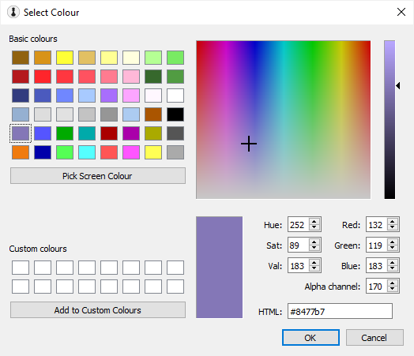
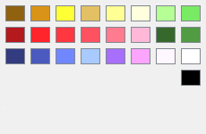
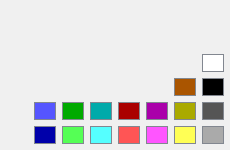

qawno
=====

Qawno is a simple cross-platform Pawn editor with syntax highlighting and script compilation support.


## Colour Picker

Going to *Edit -> Colour Selection* or pressing *Ctrl+M* will bring up the colour selection dialog, shown below:



The left half of the dialog is pre-defined colours.  `Pick Screen Colours` brings up a crosshair with which you can click anywhere on your screen to extract the colour at that point.  `Add to Custom Colours` saves the currently selected colour from the right half of the dialog to the currently selected `Custom colours` slot (make sure you select the slot first to avoid overwriting existing ones).  These saved custom colours will survive Qawno being restarted so you can use them throughout your project.  This half also includes the pre-defined `Basic colours`, detailed later:


The right half of the screen is the main colour selection area.  The two top boxes can be clicked and dragged to to adjust the current colour.  The `Hue`, `Sat` (*saturation*), and *Val* (*value*) (collectively `HSV`); or `Red`, `Green`, and `Blue` (collectively `RGB`); boxes can be used to make fine adjustments to the individual colour componenets.  The `Alpha channel` input is used by both *HSV* and *RGB* and determines the transparency of the colour.  `0` is invisible (totally transparent), `255` is fully opaque, the default is `170` (`0xAA` in hex).  The `HTML` input can be used to preview an existing colour already in *RGB* hex format, and must include the `#`.  The final panel is a larger preview of the currently selected colour, ignoring transparency:


Clicking on `OK` will insert your chosen colour in to your code at the current cursor position.  If the letter immediately before the cursor is an `x` the colour will be inserted as *RGBA*:

```pawn
#define MY_COLOUR 0x// Press Ctrl+M here.

#define MY_COLOUR 0xFF0000AA // After selecting a colour.
```

Anywhere else will give the colour in *RGB* format:

```pawn
#define MY_COLOUR "{}" // Press Ctrl+M in the braces.

#define MY_COLOUR "{FF0000}" // After selecting a colour.
```

Clicking `Cancel` will not insert anything.

The pre-defined `Basic colours` are forty eight common colours from San Andreas, SA:MP, and open.mp, in three groups:



These are the selectable game text colours.  From left to right:

First row:

* `(default)` (game texts default colour, and the currently playing radio station).
* `~h~` (default colour, but slightly lighter).
* `~h~~h~` (default colour, even lighter still).
* `~y~`
* `~y~~h~`
* `~y~~h~~h~` (the same as `~g~~h~~h~~h~~h~`).
* `~g~~h~~h~~h~`
* `~g~~h~~h~`

Second row:

* `~r~` (also the color of negative money).
* `~r~~h~`
* `~r~~h~~h~`
* `~r~~h~~h~~h~`
* `~r~~h~~h~~h~~h~`
* `~r~~h~~h~~h~~h~~h~` (the lightest any colour can go without becoming white).
* `~g~~h~`
* `~g~` (also the colour of positive money).

Third row:

* `~b~`
* `~b~~h~`
* `~b~~h~~h~`
* `~b~~h~~h~~h~`
* `~p~`
* `~p~~h~`
* `~p~~h~~h~`
* `~w~` (also any other colour with an extra `~h~`).

Fourth row:

* `~l~`



These are the 17 CGA colours, just a simple set of common primary and secondary colours.  The white and black are the same as the game text colours, and the brown on top is the later "tweaked brown".


The remaining few colours are extras with special meanings.  From left to right again:

First row:

* Game Text styles 2 and 5 default colour, plus the clock colour.
* Game Text style 6 default colour.
* Radio station changing text colour
* Y_Less' avatar's yellow.
* Y_Less' avatar's orange.
* Main brown from the SA:MP client icon.

Second row:

* open.mp branding purple.

Third row:

* SA:MP branding orange.

